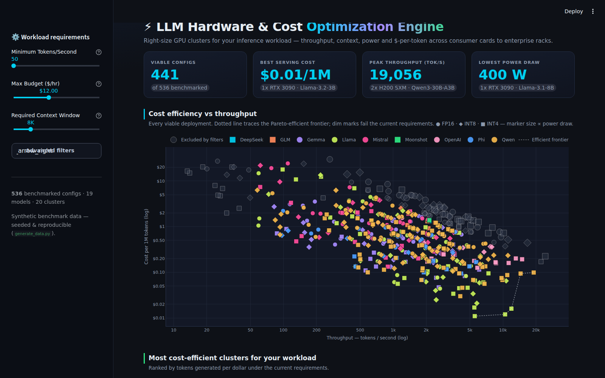

# ⚡ LLM Hardware & Cost Optimization Engine

An interactive Streamlit dashboard **and accompanying research paper** on the
economics of LLM inference: which GPU cluster serves a given model most
cost-effectively, and *why* — derived, not just benchmarked. Covers **19 major
open-weight models of mid-2026** (dense 3B→405B and MoE to 1T total parameters,
across 9 vendor families) on 20 GPU clusters.



## Two layers

**1 · The optimizer.** 536 viable deployment configs — 19 models (Llama, Qwen,
Mistral, Gemma, Phi, DeepSeek, gpt-oss, GLM, Kimi; dense and MoE) × 3 precisions
(FP16/INT8/INT4) × 20 GPU clusters (1× RTX 3090 → 8× H200) —
filterable by throughput floor, hourly budget, and context window. Plotly
cost-vs-throughput scatter with a Pareto frontier, tokens-per-dollar ranking,
seaborn throughput matrix, data explorer with CSV export.

**2 · The research.** Four numerical experiments over the underlying cost
model, presented as interactive tabs in the app and written up as a full
paper (`thesis.md` / `thesis.pdf`):

- **E1 — Workload phase map.** The cost-optimal *tier* is set by dense scale
  and *sparsity*, not workload: consumer wins every feasible cell for dense
  ≤27B **and for sparse-active MoEs like gpt-oss-120B**; dense ≥70B and the MoE
  giants are enterprise-won; every one of 945 feasible cells is won by INT4.
  A 1T-parameter MoE (Kimi-K2) serves cheaper per token than dense 123B.
- **E2 — Capacity saturation.** Tokens-per-dollar is non-monotone in cluster
  size and peaks at a closed-form size **n\*** (validated **182/182 curves**,
  dense and MoE). A second consumer GPU is worth ×2.04, not ×2 — and
  sparse-active models can arrive *pre-saturated* (gpt-oss: n\* = 1).
- **E3 — The quantization dividend.** INT4 beats its 4× byte ratio for every
  model (×4.2–×7.5, peaking on MoE); the dividend provably collapses to the
  byte ratio when the concurrency cap binds at both precisions (×2.000
  observed three times) — and for DeepSeek-V3.2 / Kimi-K2, FP16 doesn't fit a
  node at all: quantization is the admission ticket.
- **E4 — Robustness.** 400-draw Monte Carlo over all structural assumptions
  (incl. the MoE batching exponent): a small config core stays Pareto-efficient
  in ≥88% of draws; the 70B tier decision is *undecidable from point estimates*
  (consumer 42.5%); **sparsity re-opens the consumer phase** — gpt-oss-120B is
  consumer-optimal in 93% of draws.

## Quickstart

```bash
pip install -r requirements.txt
python generate_data.py     # seeded 536-config dataset (19 models)
python experiments.py       # E1–E4: results/ + figures/  (~10 s)
streamlit run app.py        # dashboard incl. Research findings tabs
python build_pdf.py         # typeset thesis.pdf from thesis.md
```

Keep the `.streamlit/` folder next to `app.py` — it forces the enterprise
dark theme. The app regenerates the dataset and experiment results
automatically if they're missing.

## Project structure

```
├── app.py                  # dashboard UI (data / filter / chart / UI layers)
├── research.py             # interactive presentations of the experiments
├── experiments.py          # E1–E4 + paper figures (seeded, deterministic)
├── generate_data.py        # cost model + catalog + SimParams (sweepable)
├── build_pdf.py            # thesis.md -> thesis.pdf (reportlab)
├── thesis.md / thesis.pdf  # the paper
├── llm_hardware_metrics.csv
├── results/                # experiment CSVs + experiments.json
├── figures/                # paper figures (PNG, dark)
└── .streamlit/config.toml  # forced dark theme
```

## The cost model in one paragraph

Decode is memory-bandwidth-bound: single-stream tokens/s ≈ aggregate
bandwidth × MBU ÷ *streamed* bytes — all weights for dense models, only the
**active** parameters for MoE (all experts must still fit in VRAM) — taxed
×0.85 per doubling of GPUs (tensor parallelism). VRAM left after weights becomes KV-cache, which buys a batched
serving uplift (batch^0.82 dense / ^0.55 MoE, capped at 32) and the context ceiling. Combos
that don't fit — or idle >94% of their VRAM — are excluded. Costs are
representative cloud rental rates; everything is seeded and lives in one
`SimParams` dataclass so the experiments can perturb it. Full formalism,
propositions, and threats to validity: see the paper.

**Honest framing:** the dataset is synthetic and model-generated. The paper's
claims are properties of the stated model under stated priors — calibrated to
public anchors, stress-tested by Monte Carlo, and stated precisely enough to
falsify on real hardware. That framing is deliberate and is discussed in §8
of the paper.

## Tech stack

Python 3 · Streamlit · pandas · NumPy · Plotly · seaborn/matplotlib ·
reportlab (paper build). Chart palette machine-validated for color-vision-deficiency
separation and ≥3:1 contrast on the `#0E1117` surface.
