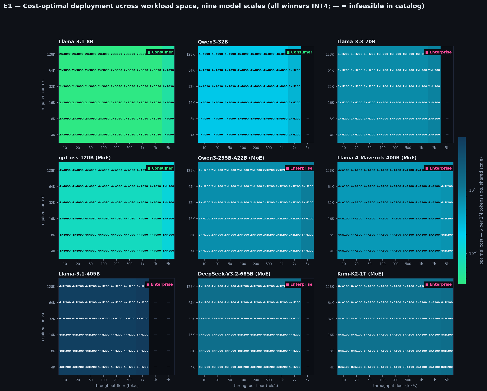
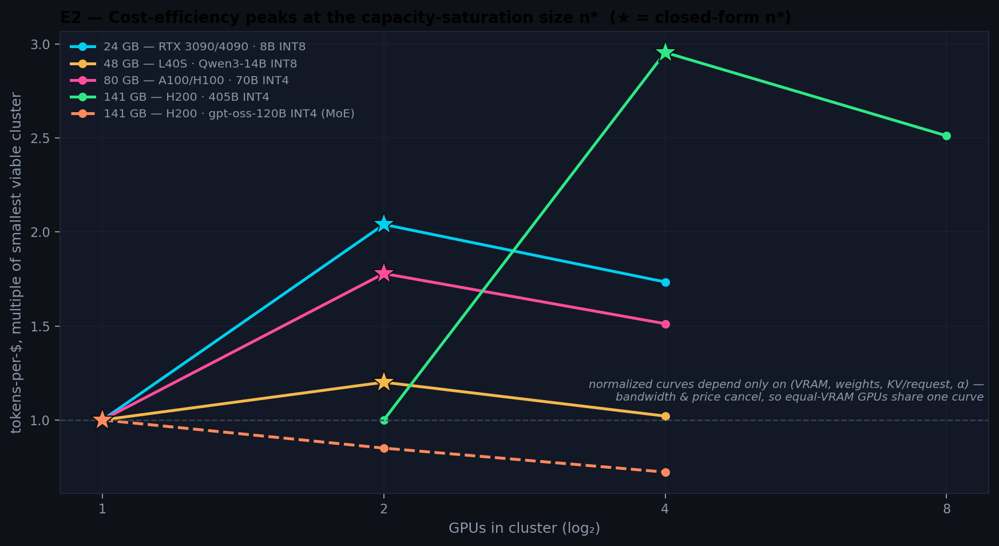
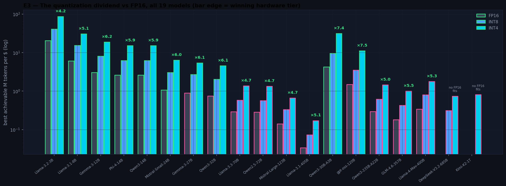
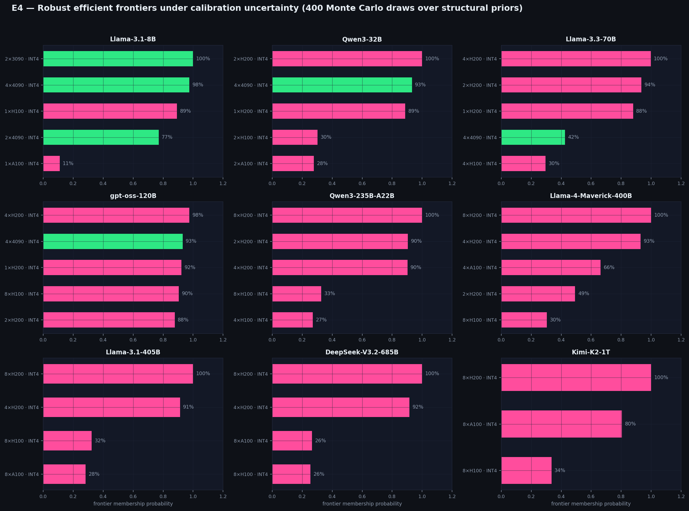
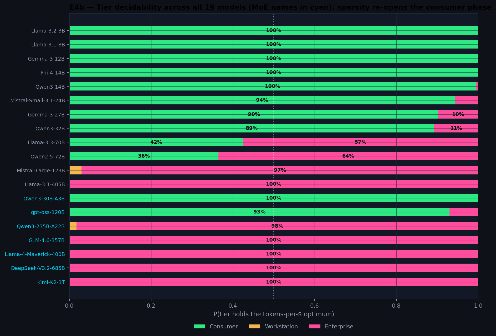

# The Economics of LLM Inference Under Memory-Bandwidth-Bound Decoding: Phase Structure, Capacity Saturation, and the Quantization Dividend

**A Simulation Study Across 19 Open-Weight Models, Dense and Mixture-of-Experts**

*Mathisha Samarawickrama — July 2026*

---

## Abstract

Selecting hardware for large language model (LLM) inference is usually treated as a benchmarking exercise: measure tokens per second on candidate systems, divide by price, pick the winner. This paper argues the decision has an analytical structure that benchmarking alone obscures. We construct a closed-form cost model of single-node LLM serving from four physical primitives — memory-bandwidth-bound decoding, tensor-parallel communication loss, KV-cache-limited batching, and rental pricing — extended to Mixture-of-Experts (MoE) models, where VRAM scales with *total* parameters but bandwidth with *active* parameters. We study its behavior over **536 viable deployment configurations**: 19 major open-weight models of mid-2026 (dense 3B–405B; MoE to 1T total parameters across 9 vendor families) × 3 precisions × 20 GPU clusters from consumer cards (RTX 3090) to enterprise racks (8× H200). Four experiments yield four results. **(1)** The cost-optimal hardware *tier* exhibits phase structure governed by scale *and sparsity*: consumer clusters win every workload map for dense models ≤32B, enterprise wins every dense model ≥123B, the 70B class is genuinely contested (consumer optimal in 42.5% of Monte Carlo draws — inside calibration uncertainty) — and **sparsity re-opens the consumer phase**: gpt-oss-120B, with 117B total but 5.1B active parameters, is consumer-optimal in 93% of draws. **(2)** Tokens-per-dollar is non-monotone in cluster size and peaks at a closed-form *capacity-saturation size* n\*; an exact discrete marginal condition predicts the empirical optimum in **182 of 182 configuration curves**, dense and MoE alike. A second consumer GPU is worth ×2.04, not ×2. **(3)** INT4 quantization's cost dividend exceeds its 4× byte ratio for every model studied (×4.2–×7.5, peaking on MoE), collapses exactly to the byte ratio when the concurrency cap binds at both precisions (observed at ×2.000 three times), and for the largest MoE models is not an optimization at all but an *admission ticket* — no FP16 configuration of DeepSeek-V3.2 or Kimi-K2 fits a single node. **(4)** Under Monte Carlo perturbation of every structural assumption, a small core of configurations remains Pareto-efficient in ≥88% of draws. The practical synthesis: **VRAM capacity buys efficiency, bandwidth buys level, precision and sparsity buy both — and past n\*, more GPUs buy only throughput.** All code, data, and experiments are seeded and reproducible in one command.

**Keywords:** LLM inference, GPU economics, memory bandwidth, KV cache, quantization, Mixture-of-Experts, tensor parallelism, Pareto efficiency, simulation study

---

## 1. Introduction

The question "which GPUs should we buy (or rent) to serve this model?" is one of the most consequential recurring decisions in applied machine learning, and one of the least systematically treated. Practitioner discussion overwhelmingly proceeds by anecdote — a benchmark of one model on one machine at one batch size — while procurement decisions extrapolate those anecdotes across model sizes, architectures, quantization levels, and cluster shapes where they do not transfer. The arrival of very large sparse models has made the extrapolation actively dangerous: a 1-trillion-parameter Mixture-of-Experts model and a 123B dense model occupy *opposite* sides of several economic boundaries despite the former being eight times "bigger."

The premise of this paper is that the *structure* of the decision is analytically tractable, because autoregressive decoding is, to first order, a memory-bandwidth problem [1, 4, 13]: generating one token requires streaming the model's activated weights through the compute units once, so single-stream throughput is bounded by aggregate memory bandwidth divided by *streamed* bytes. Around this fact, three further mechanisms determine serving economics: tensor-parallel communication loss when a model spans GPUs [8], the conversion of *spare* VRAM into concurrent requests via the KV cache [2, 3], and the market prices of the hardware itself. For MoE models [15, 16, 17], one more distinction becomes decisive: *stored* bytes (all experts) and *streamed* bytes (active experts) part ways, so the same model can be capacity-enormous and bandwidth-tiny.

We build these interactions into an explicit cost model (§3), derive its optimality structure (§4), and interrogate it with four numerical experiments (§5–6) over a catalog of 19 open-weight models spanning the mid-2026 landscape — Llama, Qwen, Mistral, Gemma, Phi, DeepSeek, OpenAI's gpt-oss, GLM, and Moonshot's Kimi — at 3 precisions on 20 cluster configurations. This is a **simulation study**: the dataset is generated by the model, calibrated to public specifications rather than measured on physical hardware, and every claim is a claim about the model's implications, stress-tested for robustness to its own calibration (§6.4, §8). We consider this framing a feature. Point benchmarks answer "what did this machine do on Tuesday"; a stress-tested model answers "what must be true for this procurement rule to hold" — and produces hypotheses stated precisely enough to falsify on real hardware.

**Contributions.**

- **C1 — A minimal, fully-specified cost model** of single-node LLM serving covering dense *and* MoE architectures (five primitives, thirteen parameters), open-source and cheap enough to sweep exhaustively (§3).
- **C2 — A capacity-saturation law.** Tokens-per-dollar is non-monotone in cluster size n; per-dollar bandwidth is invariant in n, so the *only* per-dollar return to adding GPUs is KV headroom. We derive the optimum n\* in closed form, refine it with an exact discrete marginal condition, and validate the exact form on **182/182 configuration curves** (§4, §6.2). Corollary: the normalized efficiency curve depends only on VRAM, weight bytes, KV-per-request and the batching exponent — bandwidth and price cancel — so equal-VRAM GPUs share identical curves, and sparse-active models can saturate at a *single* GPU.
- **C3 — A quantization-dividend factorization.** The cost benefit of quantization factors into byte ratio × batch-uplift × hardware-admission terms; it strictly exceeds the byte ratio whenever quantization unlocks concurrency or cheaper tiers, collapses to the byte ratio exactly when the concurrency cap binds at both precisions, and degenerates into a *feasibility condition* at trillion-parameter scale (§4, §6.3).
- **C4 — A phase-and-decidability map of the procurement decision.** Across workload space, the optimal tier is set by dense scale with a contested band at 70B-class where Monte Carlo perturbation flips the winner in 42.5% of draws — and sparsity re-opens the consumer phase at >100B total parameters (§6.1, §6.4).
- **C5 — A reproducible research artifact:** a seeded generator, a one-command experiment battery, and an interactive dashboard presenting both the optimizer and the findings across all 19 models.

## 2. Related Work

**Performance models.** The roofline model [1] established the discipline of locating workloads on a compute-vs-bandwidth plane; our model is, in effect, a roofline economics: we hold the decode phase pinned to the bandwidth roof [4, 13] and ask what follows for cost. Pope et al. [4] give the canonical treatment of transformer inference efficiency, including the memory-bandwidth-utilization framing and batching trade-offs we parameterize.

**Serving systems.** Modern servers convert spare VRAM into throughput by batching concurrent sequences: Orca's continuous batching [2] and vLLM's PagedAttention [3] are the reference designs, and Sarathi-Serve [9] refines the prefill/decode interleave. Our batch-uplift term `B^α` with a scheduler cap is a deliberately coarse abstraction: sublinear returns (α < 1) encode the drift from bandwidth-bound toward compute-bound execution as batches grow, and the cap encodes scheduler and latency-SLO limits.

**Sparsity.** Switch Transformers [15] established trillion-parameter sparsity; Mixtral [17] brought MoE to open weights; DeepSeek-V3 [16] combined large-scale MoE with Multi-head Latent Attention (MLA), collapsing KV-cache footprints roughly an order of magnitude. Our MoE extension abstracts this literature into three per-model quantities — total parameters, active parameters, KV bytes per token — plus a reduced batching exponent for expert-union bandwidth dilution (§3).

**Quantization.** GPTQ [5] and AWQ [6] made 4-bit weight quantization practical at negligible quality loss for many workloads, and Dettmers & Zettlemoyer [7] argue 4-bit is broadly compute-optimal for inference. That literature concerns *quality*; the economic literature typically stops at "4× smaller, therefore ~4× cheaper." We show the "therefore" is wrong in both directions, and by how much (§6.3).

**Parallelism, architecture, accounting.** Megatron-LM [8] established tensor parallelism and its communication costs, compressed here into a per-doubling efficiency γ. Grouped-query attention [10] and MLA [16] shrink KV-per-token (our κ); every reduction in κ shifts n\* downward and extends context ceilings. Patterson et al. [11] and Samsi et al. [12] ground the power and energy dimensions we report per configuration.

To our knowledge, the specific results here — the closed-form capacity-saturation size with its invariance corollary, the dividend factorization with collapse and admission regimes, and the tier-decidability phase map with its sparsity re-opening — have not been stated in this form.

## 3. The Cost Model

### 3.1 Primitives

For a model with `P` billion total parameters, `A ≤ P` billion *active* parameters per token (A = P for dense), at `b` bytes/parameter, served on `n` identical GPUs (per-GPU bandwidth β GB/s, VRAM `V` GB usable after a 92% runtime allowance):

**Storage.** `W_gb = 1.08 · P · b + 2` (runtime overhead + framework baseline). Viable iff `W_gb ≤ nV`; rigs idling >94% of VRAM (waste ratio > 16×) are excluded as economically unserious.

**Single-stream decode throughput** — bandwidth-bound over *streamed* bytes [1, 4]:

```
T₁ = (n · β · γ^log₂ n) · U / (A · b)                                (1)
```

with tensor-parallel efficiency γ = 0.85 per doubling [8] and memory-bandwidth utilization U ~ N(0.55, 0.04) clipped to [0.42, 0.68] [4].

**KV cache and batching.** Per-request KV at 8K context is `κ = kv₁ₖ · 8.192` GB, where `kv₁ₖ` is per-architecture: dense models use the GQA-era fit `0.05 · P^0.43` (≈0.12 GB/1K at 8B, ≈0.31 at 70B [10]); MoE models carry explicit values, because KV is set by the attention stack rather than expert count — MLA architectures (DeepSeek, Kimi) cache ≈0.07 GB/1K [16], an order of magnitude below what the dense fit would predict at their scale. Headroom `H = nV − W_gb` admits a batch

```
B(n) = min( ⌊H / κ⌋ , B_max ),    B_max = 32                          (2)
```

and serving throughput applies sublinear batching returns:

```
T = T₁ · B(n)^α,    α_dense = 0.82,   α_moe = 0.55                    (3)
```

The reduced MoE exponent models *expert-union dilution*: concurrent sequences activate an increasingly wide union of experts, eroding the weight reuse that makes dense batching cheap [15, 16]. Both exponents are swept in the robustness analysis.

**Context ceiling.** `min(model max, H/κ_tok)` snapped down to standard steps {4K … 128K} (the study grid caps at 128K; several catalog models advertise more); configurations that cannot hold 4K are non-viable.

**Cost and power.** Hourly cost `n · r` at representative mid-2026 cloud rental rates (±3% noise); power `n · TDP · 0.85 + 120 W`. The headline quantity is `$/1M tokens = cost_hr / (3600 · T) · 10⁶`, equivalently tokens-per-dollar.

### 3.2 Catalog

Six GPUs (RTX 3090, RTX 4090, L40S, A100 80GB, H100 SXM, H200 SXM) in clusters of 1–8. Nineteen open-weight models across nine families, compiled from public specifications as of July 2026:

| Class | Models (total / active parameters, B) |
|---|---|
| Dense small | Llama-3.2-3B, Llama-3.1-8B, Gemma-3-12B, Phi-4-14B, Qwen3-14B |
| Dense mid | Mistral-Small-3.1-24B, Gemma-3-27B, Qwen3-32B |
| Dense large | Llama-3.3-70B, Qwen2.5-72B, Mistral-Large-123B, Llama-3.1-405B |
| MoE | Qwen3-30B-A3B (30/3), gpt-oss-120B (117/5.1), Qwen3-235B-A22B (235/22), GLM-4.6 (357/32), Llama-4-Maverick (400/17), DeepSeek-V3.2 (685/37), Kimi-K2 (1000/32) |

Three precisions (FP16/INT8/INT4). After viability gates: **536 configurations**.

### 3.3 What the model deliberately omits

Prefill (compute-bound; dominant for long-prompt/short-completion workloads), multi-node interconnect, expert-parallel placement strategies, quantized KV caches, quantization quality loss, spot pricing, and latency SLOs beyond the concurrency cap. §8 discusses how each omission bounds the conclusions.

## 4. Propositions

**Proposition 1 (capacity saturation, first-order).** *Tokens-per-dollar as a function of cluster size n is*

```
T/$ ∝ γ^log₂ n · B(n)^α                                              (4)
```

*— per-dollar bandwidth cancels (aggregate bandwidth and price both scale ~linearly in n). The only increasing term is batch capacity, so tokens-per-dollar peaks near the smallest n whose headroom saturates the cap:*

```
n* ≈ ⌈ (κ·B_max + W_gb) / V ⌉                                        (5)
```

*Sketch.* Substituting (1)–(3), `n·β` cancels against `n·r` up to the γ tax. Below the cap, stepping n→2n multiplies (4) by `γ · (B(2n)/B(n))^α`; since `B(2n)/B(n) = 2 + W/(nV−W) > 2`, early steps gain *superlinearly* — the first GPUs mostly hold weights, the marginal GPU is nearly pure headroom. Once `B = B_max`, the multiplier is γ < 1 and efficiency strictly declines. ∎

**Proposition 1′ (exact discrete form).** *On a discrete size ladder, the optimum is the last n before the first step whose gain ratio*

```
g(n→n′) = γ^log₂(n′/n) · ( B(n′)/B(n) )^α                            (6)
```

*falls to ≤ 1.* The first-order form (5) can overshoot by one step when `B(n)` is already within `(1/γ)^{1/α}` of the cap.

**Corollary 1 (bandwidth/price invariance).** Normalizing each curve by its smallest viable cluster removes β, r, and U entirely: *curve shape depends only on (V, W_gb, κ, α)*. Equal-VRAM GPUs share identical normalized curves. Two consequences: cluster-sizing is a pure capacity problem — bandwidth and price decide which curve you are on, never where its peak is — and a sparse-active model with tiny κ can arrive *pre-saturated*: if `B(1) = B_max`, then n\* = 1 and every additional GPU strictly reduces cost-efficiency.

**Corollary 2 (dividend factorization).** For precisions q₁ (baseline) and q₂, the best-achievable tokens-per-dollar ratio factors as

```
D = (bytes₁/bytes₂) · (B₂/B₁)^α · A                                  (7)
```

*byte ratio × batch uplift × admission ratio*, where A ≥ 1 captures access to cheaper viable hardware. D > byte ratio whenever quantization unlocks batch headroom or admission; **D collapses to the byte ratio exactly when B₁ = B₂ = B_max and A = 1**. At the limit where q₁ has *no* viable configuration, D is undefined and quantization is a feasibility condition, not an optimization.

## 5. Experimental Design

E1–E3 run on the **expectation** of the model (all noise terms zeroed) so closed-form predictions can be checked exactly. E4 samples **400 Monte Carlo draws** over structural priors bracketing the plausible calibration range: U-mean ~ U(0.45, 0.65); α_dense ~ U(0.72, 0.90); **α_moe ~ U(0.45, 0.70)**; γ ~ U(0.78, 0.90); per-tier price multipliers ~ LogNormal(0, 0.15); fresh per-row noise seeds. The reference workload for frontier analysis requires ≥8K context. Everything is seeded; `python experiments.py` reproduces every number and figure in ~25 seconds on a laptop.

## 6. Results

### 6.1 E1 — The workload phase map



Across a grid of throughput floors (10–5,000 tok/s) × context requirements (4K–128K) × all 19 models (1,026 cells; Figure 1 shows nine representative panels):

- **Every one of the 945 feasible cells is won by an INT4 configuration** — precision dominates hardware choice at every scale and sparsity level (quality caveat in §8).
- **Tier follows dense scale and sparsity, not workload.** Consumer clusters win the *entire* workload map for dense models ≤27B and for the sparse-active MoEs (Qwen3-30B-A3B, and gpt-oss-120B in 8 of 9 throughput columns); dense ≥70B and the MoE giants are enterprise-won everywhere. Mid-small dense models (12–32B) cede only their extreme 5,000-tok/s column to enterprise bandwidth.
- **The cost ladder spans ~500×** for the same workload grid — and it is *not ordered by parameter count*:

| Cost floor ($/1M tok, det.) | Model | | Cost floor | Model |
|---|---|---|---|---|
| $0.012 | Llama-3.2-3B | | $0.69 | Qwen3-235B-A22B (MoE) |
| $0.032 | Qwen3-30B-A3B (MoE) | | $0.73 | Llama-3.3-70B |
| $0.033 | Llama-3.1-8B | | $1.00 | GLM-4.6-357B (MoE) |
| $0.089 | gpt-oss-120B (MoE) | | $1.24 | **Kimi-K2-1T (MoE)** |
| $0.16 | Mistral-Small-24B | | $1.36 | DeepSeek-V3.2-685B (MoE) |
| $0.22 | Qwen3-32B | | $1.51 | **Mistral-Large-123B (dense)** |
| $0.56 | Llama-4-Maverick (MoE) | | $5.83 | Llama-3.1-405B |

  A **1-trillion-parameter MoE serves cheaper per token than a 123B dense model** ($1.24 vs $1.51), and gpt-oss-120B undercuts dense 24B models. Streamed bytes, not stored bytes, set the price of a token; stored bytes set the price of *admission*.

- **81/1,026 cells are infeasible at any price** (e.g., dense 405B beyond 1K tok/s; Kimi-K2 beyond its single viable rack's reach): some SLOs are architecture problems, not budget problems.

### 6.2 E2 — Capacity saturation and n\*



The exact marginal condition (Prop. 1′) predicts the empirical tokens-per-dollar optimum in **182/182 curves (100%)** — dense and MoE; the first-order form achieves 88.5%, erring only in predicted near-saturation boundary cases. Quantitatively (Figure 2):

- A second 24 GB consumer GPU multiplies tokens-per-dollar by **×2.04** — the superlinear-headroom effect made concrete: the first card is mostly weights, the second is mostly batch capacity.
- At 141 GB serving dense 405B INT4, stepping 2→4 H200s yields **×2.96** before declining at 8.
- **gpt-oss-120B illustrates Corollary 1's pre-saturation regime**: its KV cache is so small (κ ≈ 0.57 GB/request) that one H200 already saturates the scheduler cap — n\* = 1, and the curve *only declines* (×0.85 at n=2). For sparse-active models, the marginal GPU is a pure loss unless a throughput floor forces it.
- Equal-VRAM GPUs trace identical normalized curves (Corollary 1, confirmed exactly).

**Procurement rule.** Size clusters by n\* — *add GPUs until KV headroom saturates the scheduler cap, then stop.* Past n\*, every additional GPU strictly reduces cost-efficiency while raising throughput; buy it only to meet a floor, never in the name of efficiency.

### 6.3 E3 — The quantization dividend



Comparing best-achievable tokens-per-dollar per precision (Figure 3):

| Model | INT8 ÷ FP16 | INT4 ÷ FP16 | INT4 winner (tier) |
|---|---|---|---|
| Llama-3.2-3B | ×2.00 | ×4.22 | 1× RTX 3090 (Consumer) |
| Llama-3.1-8B | ×2.53 | ×5.06 | 2× RTX 3090 (Consumer) |
| Gemma-3-12B | ×2.67 | ×6.23 | 2× RTX 3090 (Consumer) |
| Phi-4-14B / Qwen3-14B | ×2.39 | ×5.88 | 2× RTX 3090 (Consumer) |
| Mistral-Small-3.1-24B | ×2.83 | ×5.95 | 2× RTX 3090 (Consumer) |
| Gemma-3-27B | ×3.03 | ×6.05 | 4× RTX 4090 (Consumer) |
| Qwen3-30B-A3B (MoE) | ×2.24 | **×7.44** | 2× RTX 3090 (Consumer) |
| Qwen3-32B | ×2.71 | ×6.05 | 4× RTX 4090 (Consumer) |
| Llama-3.3-70B | **×2.00** | ×4.71 | 1× H200 (Enterprise) |
| Qwen2.5-72B | **×2.00** | ×4.71 | 1× H200 (Enterprise) |
| gpt-oss-120B (MoE) | ×2.35 | **×7.50** | 4× RTX 4090 (Consumer) |
| Mistral-Large-123B | ×2.35 | ×4.71 | 2× H200 (Enterprise) |
| Qwen3-235B-A22B (MoE) | ×2.11 | ×4.96 | 2× H200 (Enterprise) |
| GLM-4.6-357B (MoE) | ×2.35 | ×5.54 | 2× H200 (Enterprise) |
| Llama-4-Maverick (MoE) | ×2.35 | ×5.25 | 4× A100 (Enterprise) |
| Llama-3.1-405B | ×2.17 | ×5.10 | 4× H200 (Enterprise) |
| DeepSeek-V3.2-685B (MoE) | — | — | 4× H200 (Enterprise) |
| Kimi-K2-1T (MoE) | — | — | 8× A100 (Enterprise) |

Three regimes, exactly as Corollary 2 predicts. **Super-proportional (×4.2–×7.5 > 4×):** everywhere a dividend is defined, peaking on the sparse MoEs, where INT4 both frees KV headroom and unlocks consumer admission. **Collapse to the byte ratio:** observed at ×2.000 to three decimals for INT8 at 3B, 70B and 72B — precisely the models where the concurrency cap binds at both precisions on the same winning hardware. **Admission regime:** for DeepSeek-V3.2 and Kimi-K2, *no FP16 configuration fits a single node at all* — the dividend is undefined because quantization is the entry ticket, not an optimization.

Two structural notes. First, the winners' tier column reproduces §6.1's phase structure exactly. Second, the *largest* sparse models prefer capacity-dense cheap silicon over bandwidth-dense flagships: Llama-4-Maverick's best cluster is 4× A100 and Kimi-K2's is 8× A100 — the A100's cheap VRAM-per-dollar beats the H200's bandwidth-per-dollar once streamed bytes are small. Capacity-first procurement, again.

An economic reading: *a quantization engineer is a bandwidth procurement department.* Moving dense 70B from FP16 to INT4 does for $/token what a ~4.7× bandwidth-per-dollar hardware improvement would — several hardware generations — before any negotiation happens.

### 6.4 E4 — Robustness: the frontier that survives, and the decision that doesn't





Perturbing every structural assumption — including the MoE batching exponent — over 400 Monte Carlo draws (§5):

- **Robust cores exist at every scale.** Configurations Pareto-efficient in ≥88% of draws: 8B — 2× RTX 3090 INT4 (100%), 4× RTX 4090 INT4 (98%), 1× H100 INT4 (89%); 70B — 4× H200 INT4 (99.8%), 2× H200 INT4 (94%), 1× H200 INT4 (88%); gpt-oss-120B — 4× H200 (98%), **4× RTX 4090 (93%)**, 1× H200 (92%); 405B — 8× H200 (100%), 4× H200 (91%); Kimi-K2 — 8× H200 (100%), 8× A100 (81%). These survive any calibration inside the priors: a procurement shortlist that does not require trusting point estimates.
- **The tier decision is a phase transition with a contested band — and a sparsity exception** (Figure 5). P(consumer holds the tokens-per-dollar optimum): ~**100%** for dense ≤14B, **94%/90%/89%** at 24B/27B/32B, **42.5%** at 70B, **36.5%** at 72B, **0%** for every model ≥123B — *except* the sparse-active MoEs: **100%** for Qwen3-30B-A3B and **93%** for gpt-oss-120B. A 117B-total model behaves economically like a small model that happens to need 120B-class VRAM.

The 70B band deserves emphasis because 70B-class dense models remain the workhorse of open-weight deployment: the model's verdict is not "H200 wins" but "**this decision cannot be made from point estimates**" — it flips on ±15% price movement or a few points of MBU. Which is itself actionable: below 32B or above 123B dense, stop benchmarking and buy; at 70B, benchmark *your* workload on *your* candidate rigs, because the general answer does not exist.

## 7. Discussion

**Capacity first, bandwidth second.** The through-line of E1–E3 is that VRAM *capacity* — not bandwidth, not FLOPs — is the binding economic resource in single-node serving. Bandwidth sets the level of the efficiency curve but never its shape (Corollary 1); capacity sets viability, batch depth, context ceilings, and n\*. The pattern now extends to the top of the market: the cheapest racks for trillion-parameter MoEs are built from A100s, the capacity-per-dollar champion, not H200s.

**Sparsity is the new small.** The catalog's most consequential boundary is not 70B; it is the active-parameter count. gpt-oss-120B prices like an 8–24B dense model; Kimi-K2 prices below dense 123B. If open-weight development continues to favor sparse architectures with compressed KV (MLA and successors), the consumer-viability frontier moves *up* the total-parameter axis — and the mid-2026 "enterprise-only above 70B" heuristic quietly expires.

**The contested band is a market signal.** The 70B stalemate arises because consumer VRAM-per-dollar and enterprise bandwidth-per-dollar price 70B-INT4 serving within ~1% of each other at mid-2026 rentals. A ~15% enterprise price cut, cheaper 48 GB consumer parts, or further KV compression each tip it. The model turns "which should we buy?" into "which parameter do you believe will move?"

**Every winner is INT4.** No FP16 or INT8 configuration wins a single one of 945 workload cells, and at trillion scale FP16 does not even fit. The correct reading is that high-precision serving carries a 4.2–7.5× *price premium* that must be justified by measured quality requirements, not by default (§8).

## 8. Threats to Validity

**Synthetic calibration.** All quantities derive from a parameterized model anchored to public specifications and representative rental prices, not measurements. Mitigations: the calibration is explicit (thirteen parameters in one dataclass); E4 perturbs all of them jointly and reports which conclusions survive.

**Post-cutoff model specifications.** Parameter counts, active-parameter counts, and KV architectures for 2025–26 models (gpt-oss, GLM-4.6, DeepSeek-V3.2, Kimi-K2, Mistral-Large-3-era family) are compiled from public model cards and industry references as of July 2026; MoE KV values are architecture-derived estimates. Errors here shift individual models along the cost ladder without disturbing the structural results (Props. 1–1′, Corollaries 1–2), which are calibration-independent.

**MoE abstraction.** The `α_moe` exponent compresses expert-routing locality, expert parallelism, and union-of-experts bandwidth dilution into one parameter, swept over a wide prior (0.45–0.70). Real MoE serving efficiency varies with routing entropy and batch composition; our MoE throughput levels are deliberately conservative, and the *qualitative* sparsity findings (consumer re-opening; A100 preference; admission regime) hold across the prior.

**Decode-only scope.** Prefill is compute-bound and can dominate long-prompt workloads; chunked-prefill schedulers [9] narrow but do not eliminate the gap.

**Quantization quality.** The model prices tokens, not their quality [5, 6, 7]. A deployment whose evals fail at INT4 should read E3 as the price of quality, not a recommendation.

**Single-node scope.** Multi-node serving introduces interconnect terms that break the price-cancellation in Prop. 1; the 405B/685B/1T conclusions should not be extrapolated beyond one node.

**Market volatility.** Rental prices move weekly; the LogNormal(0, 0.15) prior covers ±~35% swings at 2σ, and tier decidability is exactly the sensitivity report for this risk.

## 9. Conclusion and Future Work

We modeled the economics of memory-bandwidth-bound LLM serving across the full mid-2026 open-weight landscape and found structure worth knowing: a closed-form cluster-sizing law validated at 100% within the model on 182 curves; a quantization dividend that provably exceeds its byte ratio until a scheduler cap collapses it — and becomes an admission ticket at trillion scale; a phase map in which dense scale picks the hardware tier, sparsity overturns it, and the industry's favorite argument (consumer vs. enterprise at 70B) is undecidable from point estimates. The synthesis is one sentence: **capacity buys efficiency, bandwidth buys level, precision and sparsity buy both — and past n\*, more GPUs buy only throughput.**

Future work, in order of leverage: (1) empirical falsification of n\* and the ×2.04 second-GPU multiple on physical 2× consumer rigs — cheap, decisive tests; (2) a routing-aware MoE serving term replacing α_moe; (3) a prefill-aware two-phase extension; (4) multi-node interconnect terms for the >405B regime; (5) eval-conditioned, quality-adjusted dividends; (6) live price feeds turning the phase map into a monitored market signal.

---

## Reproducibility

```bash
pip install -r requirements.txt
python generate_data.py     # seeded 536-config dataset (19 models, 9 families)
python experiments.py       # all results + figures (~25 s)
streamlit run app.py        # interactive dashboard incl. findings tabs
python build_pdf.py         # typeset this paper
```

Repository layout: `generate_data.py` (model + catalog + SimParams), `experiments.py` (E1–E4 + figures), `research.py` + `app.py` (dashboard), `results/` (CSV + JSON), `figures/` (PNG).

## References

[1] S. Williams, A. Waterman, D. Patterson. *Roofline: An Insightful Visual Performance Model for Multicore Architectures.* Communications of the ACM, 52(4), 2009.

[2] G.-I. Yu, J. S. Jeong, G.-W. Kim, S. Kim, B.-G. Chun. *Orca: A Distributed Serving System for Transformer-Based Generative Models.* OSDI 2022.

[3] W. Kwon, Z. Li, S. Zhuang, Y. Sheng, L. Zheng, C. H. Yu, J. Gonzalez, H. Zhang, I. Stoica. *Efficient Memory Management for Large Language Model Serving with PagedAttention.* SOSP 2023.

[4] R. Pope, S. Douglas, A. Chowdhery, J. Devlin, J. Bradbury, A. Levskaya, J. Heek, K. Xiao, S. Agrawal, J. Dean. *Efficiently Scaling Transformer Inference.* MLSys 2023.

[5] E. Frantar, S. Ashkboos, T. Hoefler, D. Alistarh. *GPTQ: Accurate Post-Training Quantization for Generative Pre-trained Transformers.* ICLR 2023.

[6] J. Lin, J. Tang, H. Tang, S. Yang, W.-M. Chen, W.-C. Wang, G. Xiao, X. Dang, C. Gan, S. Han. *AWQ: Activation-aware Weight Quantization for LLM Compression and Acceleration.* MLSys 2024.

[7] T. Dettmers, L. Zettlemoyer. *The Case for 4-bit Precision: k-bit Inference Scaling Laws.* ICML 2023.

[8] M. Shoeybi, M. Patwary, R. Puri, P. LeGresley, J. Casper, B. Catanzaro. *Megatron-LM: Training Multi-Billion Parameter Language Models Using Model Parallelism.* arXiv:1909.08053, 2019.

[9] A. Agrawal, N. Kedia, A. Panwar, J. Mohan, N. Kwatra, B. Gulavani, A. Tumanov, R. Ramjee. *Taming Throughput-Latency Tradeoff in LLM Inference with Sarathi-Serve.* OSDI 2024.

[10] J. Ainslie, J. Lee-Thorp, M. de Jong, Y. Zemlyanskiy, F. Lebrón, S. Sanghai. *GQA: Training Generalized Multi-Query Transformer Models from Multi-Head Checkpoints.* EMNLP 2023.

[11] D. Patterson, J. Gonzalez, Q. Le, C. Liang, L.-M. Munguia, D. Rothchild, D. So, M. Texier, J. Dean. *Carbon Emissions and Large Neural Network Training.* arXiv:2104.10350, 2021.

[12] S. Samsi, D. Zhao, J. McDonald, B. Li, A. Michaleas, M. Jones, W. Bergeron, J. Kepner, D. Tiwari, V. Gadepally. *From Words to Watts: Benchmarking the Energy Costs of Large Language Model Inference.* IEEE HPEC 2023.

[13] A. Gholami, Z. Yao, S. Kim, C. Hooper, M. W. Mahoney, K. Keutzer. *AI and Memory Wall.* IEEE Micro, 2024.

[14] Y. Leviathan, M. Kalman, Y. Matias. *Fast Inference from Transformers via Speculative Decoding.* ICML 2023.

[15] W. Fedus, B. Zoph, N. Shazeer. *Switch Transformers: Scaling to Trillion Parameter Models with Simple and Efficient Sparsity.* JMLR, 2022.

[16] DeepSeek-AI. *DeepSeek-V3 Technical Report.* arXiv:2412.19437, 2024.

[17] A. Q. Jiang et al. *Mixtral of Experts.* arXiv:2401.04088, 2024.

---

## Appendix A — Symbols

| Symbol | Meaning | Default |
|---|---|---|
| P, A, b | total params (B), active params (B), bytes/param | catalog |
| W_gb | weight footprint incl. overhead | 1.08·P·b + 2 |
| β, V, r | per-GPU bandwidth, usable VRAM, rental rate | catalog |
| γ | tensor-parallel efficiency per doubling | 0.85 |
| U | memory-bandwidth utilization | 0.55 |
| κ | KV cache per 8K-token request | per-architecture |
| B_max, α | scheduler cap; batching exponent (dense / MoE) | 32; 0.82 / 0.55 |
| n\* | capacity-saturation cluster size | Eq. (5)/(6) |
| D | quantization dividend | Eq. (7) |

## Appendix B — Headline numbers (deterministic model)

536 viable configs; 945/1,026 workload cells feasible, all won by INT4. n\*: 182/182 exact, 88.5% first-order. Second-GPU multiples: ×2.04 (24 GB dense), ×1.20 (48 GB), ×1.78 (80 GB), ×2.96 (141 GB dense 405B, 2→4), ×0.85 (gpt-oss-120B — pre-saturated, n\* = 1). INT4 dividends ×4.22–×7.50; INT8 collapse ×2.000 at 3B/70B/72B; dividend undefined (admission regime) for DeepSeek-V3.2 and Kimi-K2. Consumer win-rates under MC priors: ≥99% dense ≤14B; 94/90/89% at 24/27/32B; 42.5% (70B); 36.5% (72B); 0% dense ≥123B; 100% Qwen3-30B-A3B; 93% gpt-oss-120B. Cost floors: $0.012 (3B) → $0.089 (gpt-oss-120B) → $0.73 (70B) → $1.24 (Kimi-K2-1T) → $5.83 (dense 405B) per 1M tokens.

*Disclosure: the dataset is synthetic and model-generated (seeded, reproducible); all findings are properties of the stated model under the stated priors. Hardware anchors: public GPU specifications and representative mid-2026 cloud rental rates. Model specifications: public model cards and industry references, July 2026; MoE KV footprints are architecture-derived estimates.*
